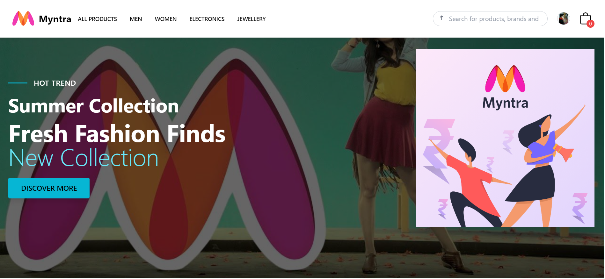

# Myntra Clone

This project is a clone of the popular Indian fashion e-commerce website Myntra, built using React, Vite, Tailwind CSS, and several other modern web development technologies. This clone aims to replicate the core features and design of Myntra while incorporating additional enhancements and learning experiences for modern React development.

## **Live Site**

Check out the live site here: [Myntra Clone](https://shubhamreact.netlify.app/)

## **Screenshots**

### Homepage


### Product Page


### Error Boundary


### Profile Page


### Cart Page


## **Features**

- **Responsive Design**: Tailored to various screen sizes using Tailwind CSS and DaisyUI components.
- **Fast Refresh with Vite**: Utilizes Vite's development server for quick builds and instant hot module replacement.
- **Error Boundary Handling**: Robust error handling using React Error Boundary, ensuring the app remains stable during unexpected crashes.
- **Context API for State Management**: Efficient state management for cart, user profile, and product details using React Context API.
- **React Router**: Seamless navigation across pages including dynamic product details, profile, and cart pages.
- **Dynamic Product Display**: Showcases products with details fetched from an API, including category-specific listings.
- **Interactive Cart Management**: Add, remove, and update cart items with real-time feedback and notifications.
- **User Profile Page**: Displays user details with edit functionality (to be expanded in future iterations).

## **Tech Stack**

- **React**: The primary JavaScript library for building user interfaces.
- **Vite**: Next-generation front-end tooling for fast builds and HMR.
- **Tailwind CSS**: Utility-first CSS framework for custom, responsive design.
- **DaisyUI**: Tailwind CSS component library for consistent and reusable UI elements.
- **Context API**: React's built-in state management for handling global state across components.
- **React Router**: For managing application routes and navigation.
- **React Error Boundary**: For gracefully handling JavaScript errors in the component tree.

## **Additional Libraries**

- **React Icons**: For including scalable vector icons in the application.
- **Axios**: For making API requests to fetch product data.
- **React Toastify**: For displaying toast notifications in response to user actions.
- **Zustand**

## **How to Run**

1. **Clone the repository:**
   ```bash
   git clone https://github.com/yourusername/myntra-clone.git


2. **Install dependencies:**
   ```bash
   npm install

3. **Open in browser: Navigate to http://localhost:3000 in your web browser to view the app.**


## Project Structure

- /src
- /components: Contains all reusable React components like Header, ProductCard, etc.
- /contexts: Houses context providers for global state management (e.g., CartContext, SidebarContext).
- /pages: Page-level components such as Home, Profile, and Product Details.
- /img: Static images used across the app.
- /utils: Utility functions and helper methods.

## Challenges Faced

- State Management: Balancing between local component state and global state management using Context API.
- Error Handling: Implementing effective error boundaries to catch and display user-friendly error messages.
- Responsive Design: Ensuring a seamless user experience across various device sizes.

## Future Enhancements

- User Authentication: Integrate login/signup functionality with OAuth or custom authentication.
- Order Tracking: Add a feature to track user orders and order history.
- Wishlist Functionality: Allow users to save products to a wishlist for future purchases.
- Enhanced Product Filtering: Implement advanced filtering and sorting options on the product listing pages.